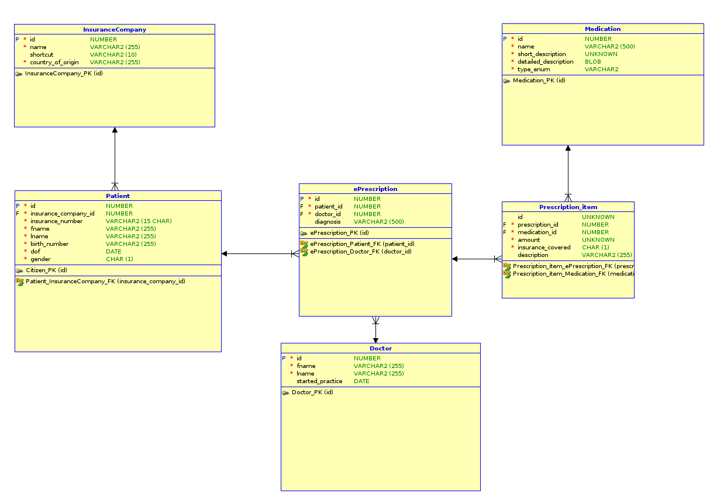

# Project alfa 3 -- Database system
## School project for SPŠE Ječná (Střední průmyslová škola elektrotechnická, Praha 2, Ječná 30)
## AUTHOR: Kuta Samuel C4b 

## Table of contents (TOC)
==========================
1. [Introduction](#introduction)
2. [Requirements](#requirements)
3. [Installation](#installation)
4. [Usage](#usage)
5. [Configurations](#configurations)
6. [Docs](#docs)
7. [Architecture and design patterns](#architecture-and-design-patterns)
8. [Application runtime behavior](#app-runtime-behaviour)
7. [Testing](#testing-and-test-scenarios)
8. [Dependencies](#dependencies)
9. [Shortcomings](#things-to-work-on-and-shortcomings)

## Introduction
This application provides a database design for managing medical ePrescriptions
for medication.

It also provides and API to work with mentioned database, and a CLI that can
operate on the API.

The application provides basic CRUD functionality, along with generating data
reports and a degree of configuration.

## Requirements
`Java` - version *20.0.1*+
`Git` - *OPTIONAL*
`MySQL Server` - version *8.0.30*+
`Gradle` - version *9.4*+ *OPTIONAL*

## Installation
Clone this repository from the command line
`git clone address <directory>`

Or download the entire repository as a zip file

Make sure all that ideally all the requirements are installed, or at least the mandatory ones.
See [Requirements](#requirements)

### DB Setup
Navigate to *db/exports* and locate the **schema.sql** and **data.sql** files.
Import the schema and the data to your MySQL database using your favorite approach.
If everything imported correctly, that database can now be used with this application.

## Usage
BEFORE running the application, make sure u have completed all steps and configured your
database entry point in *conf/config.json*. 
- See [Configurations](#configurations) for default configuration values and what should be configured.

Double click the **alfa3-all.jar** file and the program should start.

Alternatively execute this command from the command line
`java -jar alfa3-all.jar`

The User Interface will then guide you through further usage of the application.
U can also view test scenarios in /test. See [Testing](#testing-and-test-scenarios)

## Configurations
U can configure the database access point, but make sure u have the schema
set up correctly as mentioned in [Installation](##instalation)

Configurations are read from the *conf/* **config.json** file. 
- Make sure this file exists and it's struture complies with the examples below.

This file can be modified to change the database connection point; 

**config** file example:

    {
        "db":{
            "database_host":"localhost:3306",
            "database_name":"yourDB",
            "username":"username",
            "password":"password"
        }

    }

**Default configuration**
- For the default configuration ensure all the values are equal to:`default`
- **Default configuration**:

        {
            "db":{
                "database_host":"default",
                "database_name":"default",
                "username":"default",
                "password":"default"
            }

        }
- What are the **default** values?
    - `host` : localhost:3306
    - `name` : alfa3
    - `username` : su
    - `password` : student
    

## Docs
- **Developer documentation** 
    - If Gradle is installed on the system (check with `gradle -v`)
    the following command can be executed from the command line: 
        - **Windows**: `gradlew build`
        - **Unix**: `./gradlew build`
    After that u can find generated Javadoc in *build/docs/javadoc/index.html*

    - Or just read the src code and documentation directly if u dare :]
- **User documentation**
    - This can be considered as user documentation and should be read thoroughly.
    - Additional information and guides can be found in test scenarios.

## Architecture and design patterns
### Application
- The entire application is developed (or at least attempted) using **Three tier**
design architecture.
- A tier of an application can only communicate with the tier below and above it.
- **UI Tier** <--> **Application Tier** <--> **Data Tier**
- Application is seperated into three tiers:
    - **User interface tier**
    User interacts with only this tier of the application

    - **Application tier**
    This layer serves as an API that connects the layers and can do work with both of them.

    - **Data tier**
    This layer is responsible for connecting to database and providing means of receiving data and 
    processing and saving data.
    - Data tier uses the DAO design pattern to shape data from database into Class instance objects
    that are then handled by the application tier
### Database
- **Logical Diagram**

- **Relational Diagram**

    
## App runtime behaviour
- The application first initializes itself and tests database connection. If everything is correctly
setup and configured, the application starts it's run cycle.
- Application is command based and waits for user input. Once the user inputs a command, the
command hadnler of the **UI Tier** of the application communicates with the **Application Tier**
from where work can be done.
- All erros that could occur are caught by the **Application Tier** ErrorHandler class, that handles
different exceptions appropriately.

## Testing and Test scenarios
- U can find all test scenarios in *test/* as .pdf files 
- Reading this documentation is however still advised as the test scenarios function just as quick
guides
- The program does not contain any unit tests

## Dependencies
- Google.com GSON Json parsing and serialization tool. See [GSON](https://github.com/google/gson) 
- MySql JDBC Driver. See [MySQL Connector/J](https://mvnrepository.com/artifact/com.mysql/mysql-connector-j)

## Things to work on and shortcomings
- The application does not provide a great way to delete data from db if the 
rows depend on each other. This couldn't be implemented due to lack of time.
- The User Interface is quite bland and boring. Colors couldn't be implemented
due to lack of time.
- The application doesn't provide perfect information to solve every error 
encountered in the user interface. This couldn't be implemented due to lack of time.
- Application uses a three tier architecture, however I'm inexperienced with
building three tier applications so the implementation propably isn't very good.
- Imports also couldn't be implemented due to lack of time and burnout.
- Reports were originally meant to be generated in .pdf format, but this would
be very time consumign manually and most libraries that accomlpish this have 
some not so great licensing requirements

